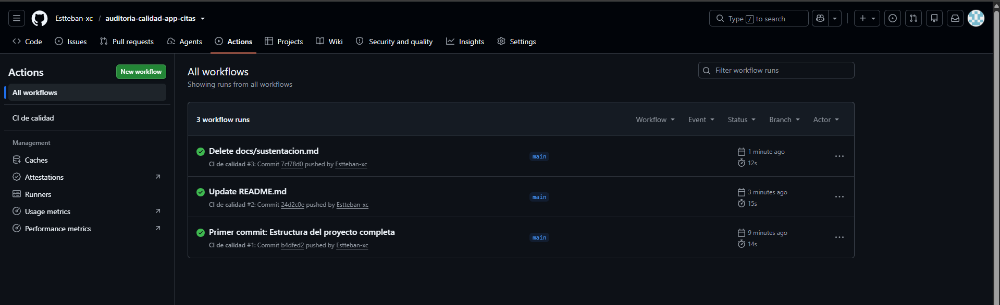
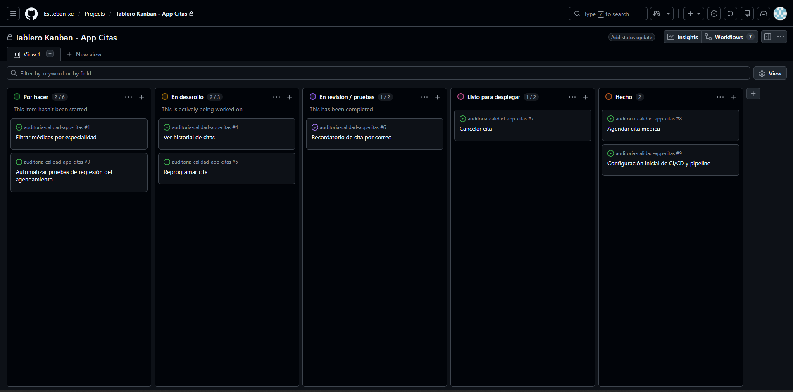

# Auditoría de calidad de un equipo ágil

**Curso:** Estándares y Métricas de Calidad de Software
**Tema:** cumplimiento de estándares en Scrum, Kanban, XP y DevOps
**Equipo:** _(escriba aquí los nombres de los integrantes)_
**Tablero:** _(escriba aquí el enlace de Trello / GitHub Projects; captura en `docs/tablero.png`)_

## 1. El caso

Una startup entrega una app de citas médicas cada 2 semanas. Tiene defectos que llegan a producción, hace las pruebas de forma manual y despliega los viernes. Este repositorio es la auditoría: diagnostica los problemas, propone prácticas de Scrum, Kanban, XP y DevOps, y demuestra la calidad con evidencia verificable (pruebas automáticas, pipeline en verde y métricas).

## 2. Resumen de resultados

| Aspecto | Resultado |
|---|---|
| Pruebas unitarias | 7 pruebas, todas en verde |
| Cobertura de `src/` | 100 % (la puerta de calidad exige ≥ 80 %) |
| Pipeline de CI | GitHub Actions: instala dependencias, corre pruebas y falla si la cobertura baja del 80 % |
| Frecuencia de despliegue | 0,71 por día (20 en 28 días, unos 5 por semana) |
| Lead time de cambios (mediana) | 20 horas |
| Tasa de fallo de cambios | 20 % (4 de 20 despliegues) |
| Tiempo medio de recuperación | 4,5 horas |
| Hallazgo principal | Los 3 despliegues hechos en viernes fallaron (100 %); en los demás días falló 1 de 17 (aprox. 6 %) |

## 3. Qué se hizo en cada bloque

### Bloque 1: Diagnóstico con ISO/IEC 25010:2023
Se asoció cada problema del caso con un atributo de calidad, una subcaracterística y una métrica.

| Problema | Atributo | Subcaracterística |
|---|---|---|
| Defectos que llegan a producción | Fiabilidad | Ausencia de fallos |
| Pruebas solo manuales | Mantenibilidad | Capacidad de ser probado |
| Despliegues los viernes sin control | Fiabilidad | Recuperabilidad |
| Datos de pacientes (riesgo inferido) | Seguridad | Confidencialidad |

Detalle en [`docs/atributos_iso25010.md`](docs/atributos_iso25010.md).

### Bloque 2: Scrum y Kanban
- **Definition of Done** de 6 criterios verificables, cada uno con su atributo ISO y su evidencia: revisión por pares, pruebas con cobertura ≥ 80 %, aceptación del Product Owner, sin vulnerabilidades ni secretos, plan de rollback con despliegue de lunes a jueves, y sin defectos críticos abiertos. Ver [`docs/DoD.md`](docs/DoD.md).
- **Tablero Kanban** con 5 columnas y límites de trabajo en curso (WIP): Por hacer (6), En desarrollo (3), En revisión / pruebas (2), Listo para desplegar (2) y Hecho (sin límite). Cada columna tiene política de entrada y de salida. Ver [`docs/politicas_kanban.md`](docs/politicas_kanban.md).

### Bloque 3: XP y TDD
- Se escribieron primero las pruebas en [`tests/test_citas.py`](tests/test_citas.py) y luego se implementó `calcular_copago` en [`src/citas.py`](src/citas.py).
- Reglas cubiertas: contributivo paga el 10 %, subsidiado 0, particular el 100 %, valor negativo y tipo desconocido lanzan `ValueError`, y el resultado se redondea a 2 decimales.
- Se definieron 5 reglas de codificación en [`docs/reglas_codificacion.md`](docs/reglas_codificacion.md): prueba primero, nombres claros, funciones pequeñas, fallar con claridad e integración pequeña y frecuente.

### Bloque 4: DevOps y puerta de calidad
El workflow [`.github/workflows/ci.yml`](.github/workflows/ci.yml) se ejecuta en cada `push` y `pull_request`. Configura Python 3.12, instala las dependencias y ejecuta `pytest --cov=src --cov-fail-under=80`. Si una prueba falla o la cobertura es menor al 80 %, el job termina en rojo y el cambio no debe aceptarse. La evidencia está en la pestaña **Actions** de este repositorio.

### Bloque 5: Métricas
- Se calcularon las 4 métricas DORA con [`datos/despliegues.csv`](datos/despliegues.csv). La hoja de cálculo con las fórmulas es [`datos/metricas_DORA.xlsx`](datos/metricas_DORA.xlsx) y el resumen está en [`docs/metricas.md`](docs/metricas.md).
- Se eligió una métrica por enfoque, con el atributo ISO que respalda: Scrum (% de historias que cumplen la DoD), Kanban (tiempo de ciclo y cumplimiento de WIP), XP (cobertura de pruebas) y DevOps (tasa de fallo de cambios).
- Observación sobre los datos: el despliegue #20 tiene fecha 2026-09-30, posterior al último día del periodo. Se incluyó tal como fue entregado. Sin él, la mediana del lead time sigue en 20 h y la frecuencia sería 0,68 por día.

### Bloque 6: Plan de cumplimiento
El guion de la sustentación de 3 minutos está en [`docs/sustentacion.md`](docs/sustentacion.md). Su meta es bajar la tasa de fallo de cambios por debajo del 10 % y no volver a desplegar los viernes.

## 4. Estructura del repositorio

```
.
├── README.md
├── requirements.txt
├── .github/workflows/ci.yml      # pipeline con puerta de calidad
├── src/citas.py                  # función calcular_copago
├── tests/test_citas.py           # pruebas unitarias (TDD)
├── datos/
│   ├── despliegues.csv           # datos simulados de 28 días
│   └── metricas_DORA.xlsx        # cálculo de métricas DORA
└── docs/
    ├── atributos_iso25010.md     # bloque 1
    ├── DoD.md                    # bloque 2
    ├── politicas_kanban.md       # bloque 2
    ├── reglas_codificacion.md    # bloque 3
    ├── metricas.md               # bloque 5
    └── sustentacion.md           # bloque 6
```

## Evidencias del Proyecto

* **Ejecución exitosa del Pipeline (Puerta de Calidad):** 
  

## Tablero Kanban (Bloque 2)

El tablero Kanban con la gestión visual del proyecto, sus 5 columnas y los límites de Trabajo en Progreso (WIP) configurados está disponible en la pestaña Projects de este repositorio:

* [Ver Tablero Kanban en GitHub Projects](https://github.com/Estteban-xc/auditoria-calidad-app-citas/projects)

### Vista del Tablero



Puedes consultar la documentación de políticas en:
* [Políticas Kanban y WIP](docs/politicas_kanban.md)
  

## 5. Cómo ejecutar las pruebas

```bash
pip install -r requirements.txt
pytest --cov=src --cov-fail-under=80
```

En GitHub Codespaces o en cualquier terminal con Python 3.12. No requiere instalar nada más.

## Integrantes del Equipo

* Samuel Nieto Pardo
* Nelson Julián Martínez Bedoya
* William David Vivas Maldonado
* Mauricio Esteban Varela Cañon
